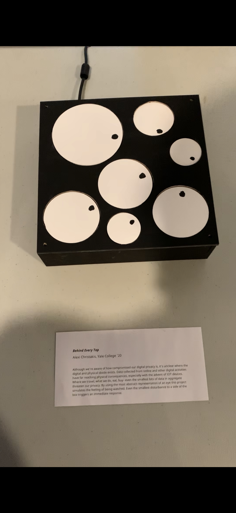
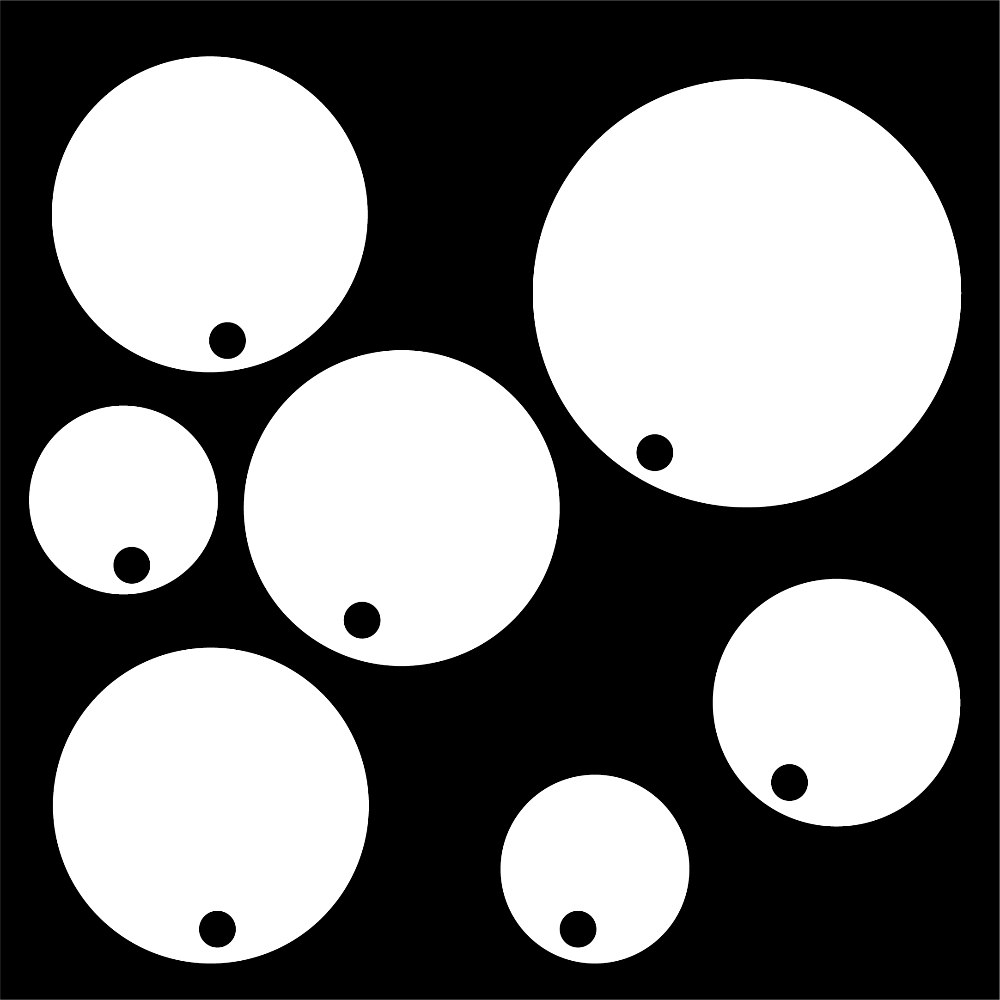
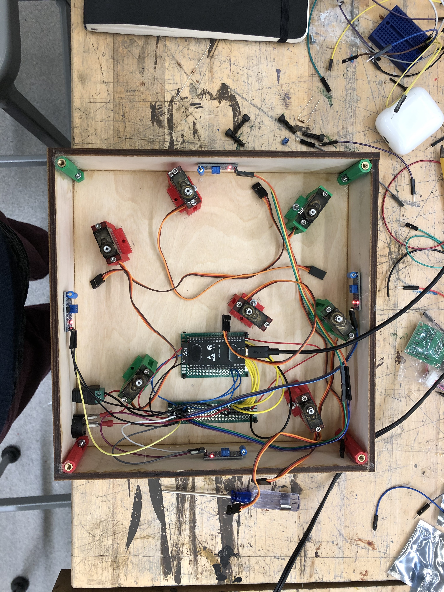
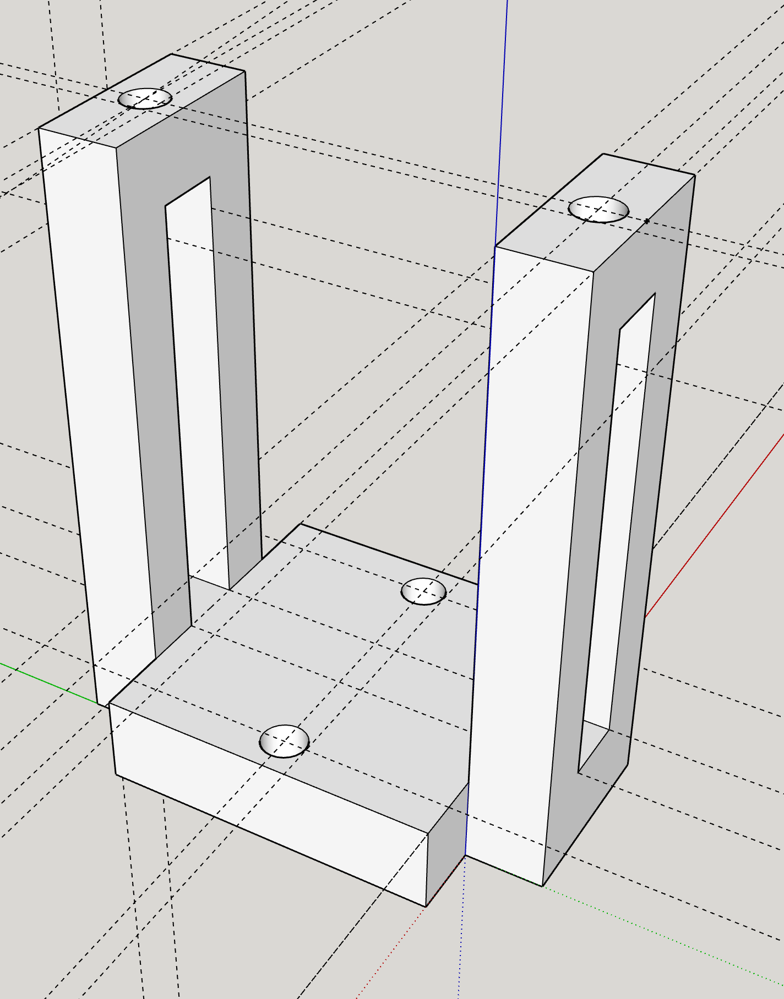
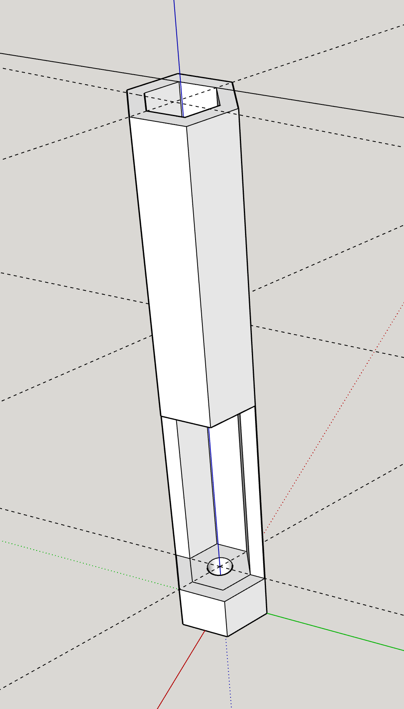

# Behind Every Tap

A simple box with 7 eyes that look towards any side that is tapped. The enclosure is constructed out of laser-cut plywood, 3D printed mounting brackets, and wood glue. All fabrication files can be found under the fabrication folder.

## Artist Statement

Although we’re aware of how compromised our digital privacy is, it’s unclear where the digital and physical divide exists. Data collected from online and other digital activities have far reaching physical consequences, especially with the advent of IOT devices. Where we travel, what we do, eat, buy--even the smallest bits of data in aggregate threaten our privacy. By using the most abstract representation of an eye this project simulates the feeling of being watched. Even the smallest disturbance to a side of the box triggers an immediate response.

## Materials List

### Electronics

7 180deg micro-servos (~$28)

1 MPU6050 accelerometer (~$20)

1 ESP32 (~$20)

1 10amp 5v power brick (~15)

1 power switch (<$1)

#### Total: ~$85

### Enclosure

1 24in x 24in sheet of 0.24in thick plywood (~$7)

7x3 male headers for the servos

2x16 male headers for an ESP mount

wood glue

jumper wires, solder

various screws, and nuts to secure the box

black & white acrylic paint

access to laser cutter

access Makerbot 3D printer

## Fabrication

Because readily-available positionally-aware servos have a limited range of 180 degrees, the layout had to carefully consider the angle of each mounted servo to enable them to look at all 4 sides of the box. In the layout shown below, every servo has its available range directed towards the center of the box, with two extremes positioned at two adjacent sides.

While the original plan involved using either piezoelectric or vibration sensors to detect which side of the box the user tapped, it ultimately was too difficult to differentiate between the sensor's signals to determine which side was activated. Using an accelerometer, the box listens to it's horizontal and vertical acceleration to detect if it was tapped. One issue with this solution is that the deceleration of the box can outweigh the initial acceleration, leading to the code misreading the data as a tap from the opposite side.

### Layout

### Wiring

The wiring diagram shows each mounted servo with a dashed circle representing the size and position of the eye it controls, as well as a dashed semi-circle depicting the available rotation. The 7 servos are connected to the ESP's pins 12, 13, 14, 25, 26, 27, and 33 for PWM position control. The accelerometer is powered from the 5V pin, and uses pins 2 and 15 for digital data transfer with help from the Wire library.

Power comes from a converter supplying 10 amps at 5 volts to a daughter-board which powers each servo and the ESP in parallel. 7 sets of 3 pin male headers are connected to the rail, with the signal pins connected to the ESP.

Here's an picture from the box's construction where vibration sensors were still being used:

The servo mounts which secure the motors to the bottom plate of the box were designed in SketchUp and look like this:

Four connector pieces were also printed to secure the lid to the box in a removable way. They hold a nut in each side to make the construction easier.

